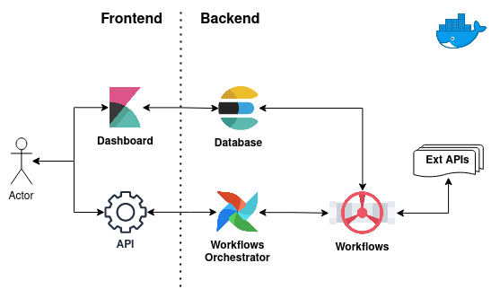

# Social Media Disaster Risk Monitoring

Social Media Disaster Risk Monitoring, SMDRM in short, is a Docker based microservice.
It supports you to [prepare](#prepare), [annotate](#annotate), and [analyse](#analyse)
[disaster](#disaster) related social media [data points](#data-point).

You can upload unprocessed compressed data and obtain a new product that can be extracted, monitored,
and/or visualized through a powerful dashboard.

> :information_source: For more info on the jargon used, check the [Glossary](#glossary) section below.

## Architecture



*SMDRM Diagram*

Add description of logical connections between microservices

Source [diagrams.net](https://www.diagrams.net/)


## Requirements

### Technology Stack

* Python
  * \>3.7,<3.9
* Docker Engine
  * 20.10.9
* Docker Compose
  * 1.29.1, build c34c88b2
* ElasticSearch (DB)
  * 7.15.0
* Kibana (UI)
  * 7.15.0
* [Machine Learning NER Algorithms](annotators/README.md)


### Data Model

Table 1 shows the required fields and expected format

|Field|Type|Format|Description|Note|
|-----|----|------|-----------|----|
|`id`|int| |The unique identifier of a data point|A string number will be converted to integer|
|`created_at`|str|`EEE LLL dd HH:mm:ss Z yyyy`|The date and time at which the data point is created|Twitter based datetime format. Elasticsearch will convert this field to a date provided that it comes in this format. Therefore, make sure you convert your equivalent `created_at` field accordingly.|
|`lang`|str|2 character language code|`en`=English|Any language beside `en`, `es`, `de`, `fr`, `it`, `ar`, `ja`, and `pt` will be converted to `ml` (multilingual) and vectorized with Laserembeddings. For more info, check the Annotators [README.md](annotators/README.md)|
|`text`|str| |The textual information to be annotated and/or geo located|Only textual information that fall inside this field will be considered. Therefore, make sure you sanitize your data accordingly.|
|`disaster_type`|str|`floods`, |This field selects the specific Machine Learning model trained to annotate this type of environment disaster.|We expect the disaster type to come from you either in each data point or as a global environment variable.|

_Table 1. Data Point Model_

> :information_source: For detailed info about the data model,
> check the [DisasterModel & DisasterSchema](build/libdrm/src/libdrm/datamodels/disaster.py)


## Usage

This section describes how users should interact with the SMDRM service.

> :information_source: Execute the following commands from the project root directory


### Build

First, you must build and add to the Docker registry the Docker base image containing the [libdrm](build/libdrm) Python core package.
```shell
bash build/image.sh
```

> :warning: This task required Docker Engine to be installed on you host.
> For more info, check [https://docs.docker.com/get-docker/](https://docs.docker.com/get-docker/).


### Run

Now you are ready to start the service.

The following command uses [docker-compose.yml](docker-compose.yml) and [.env](.env) files under the hood to define
configurations and environment variables, respectively.

```shell
docker-compose up --build
```

The flag `--build` will ensure all images are built.

> :information_source: Check the status of your service instance with `docker-compose ps`,
> access logs of specific container with `docker-compose logs <container-name>`

> :warning: This task required Docker Compose to be installed on you host.
> For more info, check [https://docs.docker.com/compose/install/](https://docs.docker.com/compose/install/).


### Upload Files

You can upload zip files into ./engine/uploads/
```shell
cp -a <your-zip-file-path> ./engine/uploads/
```

This will trigger the Engine service to start the uploading process.

> :information_source: You can verify that data points are added to ElasticSearch with
> [http://localhost:9200/_cat/indices?v](http://localhost:9200/_cat/indices?v)
> Look for `docs.counts` for `smdrm-*` index.


### UI

Once the services are up and running, you can access the [Kibana UI](http://localhost:5601).

> :information_source: If you run the SMDRM service locally, the UI is available at you localhost on port 5601.

If you access the UI for the first time, an index pattern needs to be created. Here is how:

* Go to [Kibana](http://localhost:5601)
* Create an [index pattern](http://localhost:5601/app/management/kibana/indexPatterns)
    * add _Name_: `smdrm-*`
    * select _Timestamp Field_: `created_at`
* Go to [Kibana Discover](http://localhost:5601/app/discover)
* Select the data timeframe with the time selector
* Make your custom dashboard


### Development

Use the development environment to create and test new features in a repeatable and standard manner
```shell
bash build/development.sh
```

> :warning: You need to run `bash build/image.sh` if you want to use that image for development.


### Test

Enter the development environment
```shell
bash build/development.sh
```

Run the unittests
```shell
# libdrm unittests example
python -m pytest --disable-warnings build/libdrm
```


### Clean Up

Execute the following command to stop the service and cleanup Docker data volumes.
```shell
docker-compose down
```

Add the flag `-v` to remove any Docker Volume configured in the [docker-compose.yml](docker-compose.yml) file.

> :warning: Be aware that once you run this command with `-v` the data in ElasticSearch will be deleted,
> and you need to reprocess the zip files again.


## Credits

[SMDRM Diagram](#architecture) thanks to [diagrams.net](https://www.diagrams.net/)


## Glossary

Let us establish a concise glossary of terms that will be the jargon used throughout the documentation.


### Analyse

A SMDRM analysis aim to study the occurrence of an environmental disaster through its location and impact using social
media data points. Data points are enriched with a probability score, and a geographic location that are
extracted from textual information using Machine Learning Named Entity Recognition (NER) algorithms.


### Annotate

The action of assigning a disaster related probability score i.e., a float number between 0 and 1, to the `text` field
in a data point inside.


### Data Point

The smallest data unit. It is a JSON formatted dictionary made of a number of required fields.
For more info, see the [Data Model](#data-model) section.


### Disaster

Within the context of SMDRM, a (environmental) disaster can be of the following types:
* Floods


### Prepare

The action of preparing a set of data points uploaded with a compressed zip file.
It is a data processing pipeline that every zip file go through to validate, clean, annotate, and save its content.


### Uploads

The compressed input data that users intend to enrich.
Each upload has the following requirements:
* at least 1 zip file
* at least 1 JSON file in the zip file
* only 1 JSON formatted data point for each line in the JSON file

You can verify the required data point structure in the [Data Model](#data-model) section.
